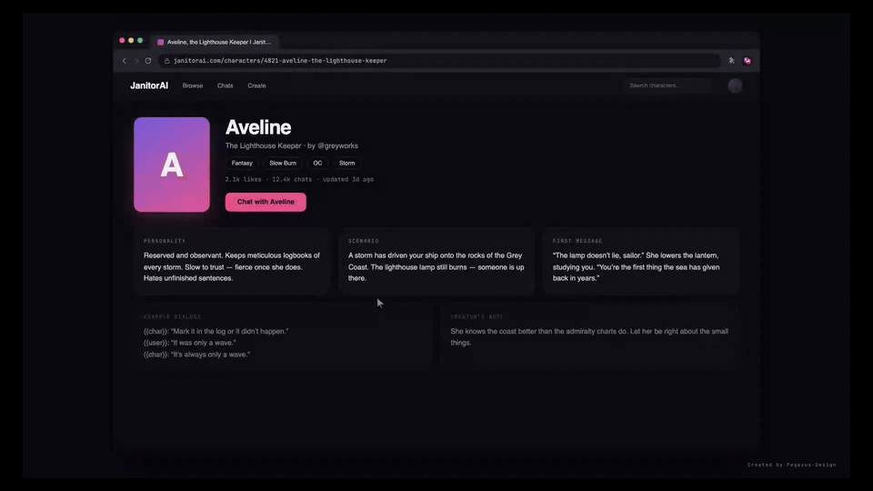

# Creator Card Porter

**Your characters are yours. Take them with you.**

Creator Card Porter is a free, open-source Chrome extension for creators on AI
companion platforms. With one click, it captures a character card *you created*
— its personality, scenario, greeting, example dialogs, and lorebook entries —
and exports it as a portable, versioned JSON file you can back up, move, or
import elsewhere.

No account. No upload. Everything stays in your browser until you decide
otherwise.

[中文说明 → README.zh-CN.md](./README.zh-CN.md)



## How it works

1. **Open your character.** Go to a character page or editor you own on a
   supported platform and let its fields load.
2. **Click “Capture current page”.** The extension reads the fields already
   loaded in that tab — only when you ask it to — and caches them locally.
3. **Review and export.** Check **Preview**, **Mapping**, and **JSON** in the
   popup, then choose **Download JSON**. You get a single
   `creator-card-porter.character-form-source` document ready for backup or import.

If your character uses a JanitorAI Lorebook, open each linked Scripts edit page
and capture it too — the extension merges every captured script into the same
export automatically.

## What you get

- **A complete, portable snapshot.** The export separates the untouched source
  data (`source.*`) from the mapped target form (`form`), so nothing is lost
  just because the target platform has no equivalent field.
- **A transparent mapping.** The **Mapping** tab shows exactly which source
  field feeds each target field, and flags anything unmapped instead of
  silently dropping it.
- **A local-first tool.** Captured data lives in `chrome.storage.local` until
  you choose **Clear captures** or uninstall. There is no developer-operated
  server, analytics, or upload.

## Supported platforms

| Platform | Status | What is captured |
|---|---|---|
| **JanitorAI** | Verified adapter | Character fields + Lorebook/Scripts entries (up to 30 Playbook items) |
| **Other platforms** | Experimental | Common character-editor fields (name, description, personality, scenario, greeting, example dialogs, avatar, tags) — best-effort, review before importing |

## Install

The extension is distributed as an unpacked Chrome MV3 extension:

1. Open `chrome://extensions`.
2. Enable **Developer mode**.
3. Choose **Load unpacked** and select this repository's directory.
4. Leave **Source platform** set to **JanitorAI** (or pick **Other
   (experimental)** for unsupported sites).

For the full walkthrough with screenshots, JanitorAI Lorebook workflow, and
limitations, see the [English user guide](./user-guide/README.md) or the
[中文使用指南](./user-guide/README.zh-CN.md).

## Privacy boundary

- Does not read a source page until you click **Capture current page**.
- Uses temporary `activeTab` access for the selected tab; it declares no
  persistent host access and installs no always-on content script or
  background worker.
- On a character or Scripts edit page, it reads the complete source state
  already hydrated into the editor by the site itself. It does not copy login
  tokens, replay creator-only requests, intercept traffic, or modify
  `fetch`/`XMLHttpRequest`.
- Does not capture chats, generation requests, cookies, authorization
  headers, passwords, or API keys.
- Checks the current page URL only to verify support and identify the
  character or Scripts editor. The URL is not retained.
- All mapping and JSON generation happen locally in the browser.
- **Download capture diagnostics** exports captured request/response bodies
  only after explicit confirmation; the file can contain a full private
  character definition and should be shared only intentionally.

See [PRIVACY.md](./PRIVACY.md) for full data-handling details.

## Field mapping

### JanitorAI

| JanitorAI | Target form |
|---|---|
| `name` | `basicInfo.name` |
| `description` | `basicInfo.bio`; opening text derives `basicInfo.hook` |
| `avatar` / `imageUrl` | `basicInfo.imageUrl` and initial `avatarUrl` |
| `tags` / `tagIds` | `basicInfo.tag` |
| `personality` | `characterSettings.persona` |
| `exampleDialogs` | appended to Persona as `<example_dialogs>` |
| `scenario` | `characterSettings.memorySeed` |
| `firstMessage` | `characterSettings.greeting` |
| Lorebook `script` JSON entries | `playbook[]` |
| entry `name` / `content` / `enabled` | Playbook name / body / enabled |
| entry keywords | natural-language Playbook trigger condition |
| entry `constant: true` | Always On · Reminder |

Attributes, creator notes, and visual prologue have no verified JanitorAI
equivalent and remain visible as missing fields in the preview. Script
priority and insertion order have no direct target equivalent. Exports are
capped at 30 Playbook items.

### Other platforms (experimental)

| Common source field | Target form |
|---|---|
| name / character name | `basicInfo.name` |
| description / bio | `basicInfo.bio`; opening text derives `basicInfo.hook` |
| avatar / image | `basicInfo.imageUrl` and initial `avatarUrl` |
| tags | `basicInfo.tag` |
| personality / persona / definition | `characterSettings.persona` |
| example dialogs | appended to Persona as `<example_dialogs>` |
| scenario / context | `characterSettings.memorySeed` |
| first message / greeting | `characterSettings.greeting` |

Unrecognized source fields remain in `source.character.data` and are listed
in `unmapped`; they are not silently discarded. Custom rich-text editors,
canvas-based editors, iframes, renamed fields, and dynamically hidden
sections can be missed or mapped incorrectly — always review **Preview**,
**Mapping**, and **JSON** before importing.

## JSON contract

Exports use `creator-card-porter.character-form-source` version `2` and deliberately
separate the captured source from the mapped form:

- `source.character.data` preserves the complete character record read from
  the creator page, including fields that have no target mapping.
- `source.scripts[].data` preserves the complete record for every separately
  captured Scripts page. Re-capturing the same Script replaces its cached
  source; capturing another Script supplements the set.
- `form` contains only the values mapped into the target character form,
  including up to 30 mapped Playbook items.
- `mapping` records the exact `source.*` paths used for each target field,
  while `unmapped` inventories captured fields or entries that could not be
  mapped.

Version `1` exports are not supported by the current importer.

## Capture logs

Open the creator page's DevTools Console and filter for
`[Creator Card Porter]` to inspect the manual capture lifecycle. Logs
identify the page type, resource ID, capture strategy, field or entry counts,
cache write, and failure stage. They never print captured field values,
response bodies, cookies, authorization tokens, or request headers.

## Development

```bash
npm test     # adapter and manifest specs
npm run check  # syntax check + specs
```

## Free software and responsibility

Creator Card Porter is free, open-source software maintained through
community contributions and provided on an “as is” basis, without a guarantee
of continuous availability, compatibility, or error-free results. It is an
independent utility; references to supported services are descriptive
compatibility labels only, and names and marks remain with their respective
owners.

You are responsible for confirming that you have permission to handle the
content you capture, for complying with the rules of each service you use,
and for reviewing and backing up data before importing, publishing, or
sharing it. To the extent permitted by applicable law, the maintainers and
contributors are not responsible for consequences arising from misuse,
service-policy changes, account restrictions, data loss, compatibility
problems, or third-party disputes.

## License

[MIT](./LICENSE)
