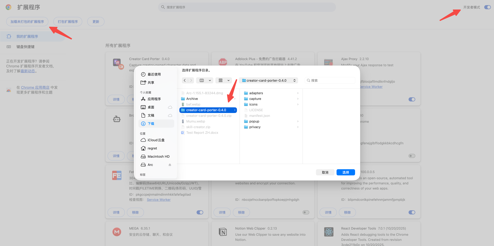
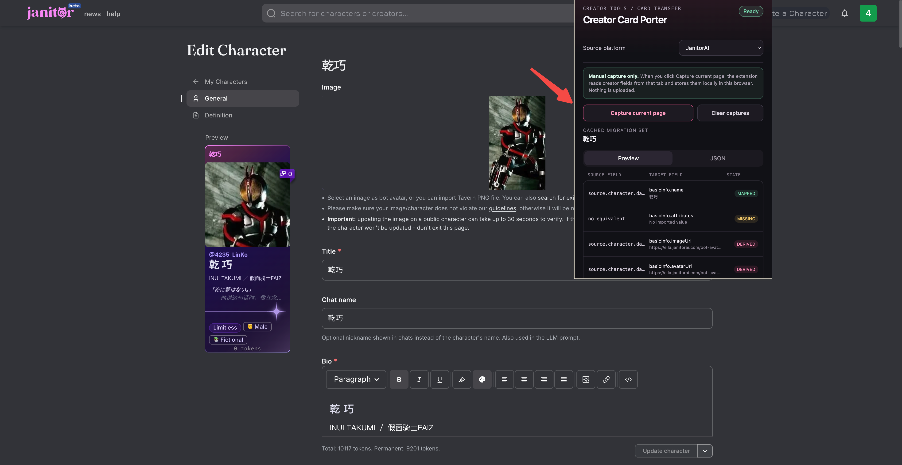
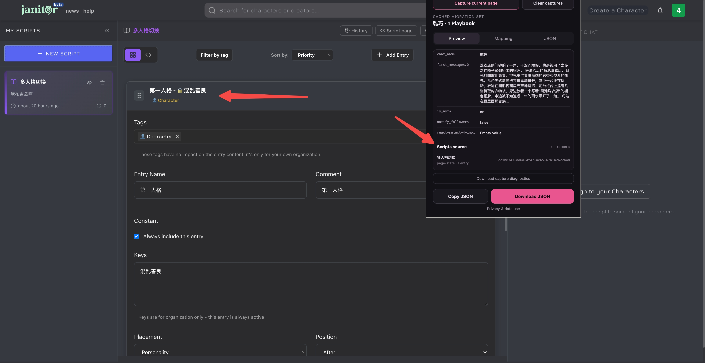

# Creator Card Porter User Guide

[中文使用说明](./README.zh-CN.md)

## 1. What is it?

Creator Card Porter is a Chrome extension for moving character cards between
platforms.

It reads characters and Lorebooks that you are authorized to manage on the
source platform, then organizes them into a JSON file you can keep as a backup
or import into any tool that accepts this format.

The extension only reads, previews, and exports data. It never publishes a
character automatically.

This is an independent open-source utility maintained through community
contributions. Platform names in this document are used only to describe
compatibility. Their names and marks remain with their respective owners.

## 2. When should I use it?

- Use the desktop version of **Google Chrome**.
- Sign in to the source platform before capturing.
- Only move characters that you created or are explicitly authorized to manage.
- A Janitor character and its Lorebook must be captured separately. The extension
  will combine them locally.
- For other platforms, you can try the `Other (experimental)` form capture, but
  you must review the result manually.

## 3. How do I use it?

### Step 1: Install the extension

1. Extract the extension ZIP file.
2. Open this address in Chrome:

   ```text
   chrome://extensions
   ```

3. Turn on **Developer mode** in the top-right corner.
4. Click **Load unpacked**.
5. Select the extracted folder. You should see `manifest.json` at the top level
   of that folder.
6. Pin `Creator Card Porter` from Chrome's Extensions menu.



### Step 2: Capture the character

1. Sign in to your JanitorAI creator account in Chrome.
2. Open the character edit page:

   ```text
   https://janitorai.com/edit_character/CHARACTER_UUID
   ```

3. Click the extension icon.
4. If you are starting a different character, click `Clear captures` first to
   remove the previous card.
5. Click `Capture current page`.
6. When the character name and `Ready` appear, the character has been captured.

The extension does not read pages automatically in the background. It reads the
current tab only after you click `Capture current page`, then keeps the result
locally in your browser.



### Using Other (experimental)

1. Choose `Other (experimental)` under `Source platform`.
2. Open the source platform's character editor, wait for the form to finish
   loading, and expand any collapsed sections you want to capture.
3. Click `Capture current page`.
4. Review the result under `Preview`, `Mapping`, and `JSON` before downloading
   or importing it.

This mode tries to recognize common fields such as name, description,
personality, scenario, greeting, example dialogs, avatar, and tags. It may miss
or incorrectly map pages that use custom rich-text editors, iframes, canvas,
unusual field names, or hidden sections. It does not automatically find a
separate Lorebook or guess unknown platform APIs.

### Step 3: Capture the Lorebook / Scripts

If the character uses a Lorebook:

1. **Do not click `Clear captures`.**
2. Open the matching Scripts edit page:

   ```text
   https://janitorai.com/scripts/SCRIPT_UUID/edit
   ```

3. Click the extension icon.
4. Click `Capture current page`.
5. Reopen the extension. A result such as `Character name · 2 Playbook` means
   the character and Lorebook have been combined.
6. If the character uses multiple Scripts, open and capture them one by one.



### Step 4: Review and export the JSON

> The exported file contains the original information captured from the source
> platform.

1. Use `Preview` to check the captured character fields and Scripts sources.
2. Open `Mapping` to review how those fields map to the standard character
   information template.
3. Open `JSON` if you want to inspect the complete file.
4. Click `Download JSON`.

---

### Optional: Import elsewhere

The exported JSON follows the `creator-card-porter.character-form-source`
format described in the repository README. You can keep it as a backup, edit
it by hand, or feed it to any importer that understands this format. Always
review the mapped fields in the destination before saving or publishing.

## Three common mistakes

1. **Do not clear captures when moving from the character page to its Scripts
   page.** The extension needs both sources to combine the character and
   Playbook.
2. **Clear captures before starting a different character.** Otherwise, a
   Playbook from the previous card may be combined with the new character.
3. **Always review results from Other.** A successful capture only means the
   extension recognized common form fields; it does not guarantee every field
   is correct.

## Free software and responsibility

Creator Card Porter is free software released under the [MIT License](./LICENSE),
maintained by community contributors, and provided as is. We work to improve it,
but cannot guarantee continuous availability, compatibility with every page, or
error-free exports.

Only handle content that you created or are explicitly authorized to use. You
are responsible for following the rules of each platform and for reviewing and
backing up data before importing, publishing, or sharing it.

All extraction is processed locally and is not sent through an external service.
To the extent permitted by law, users are responsible for consequences arising
from misuse, platform-policy changes, account restrictions, data loss,
compatibility issues, or third-party disputes; maintainers and contributors are
not liable for those consequences.
